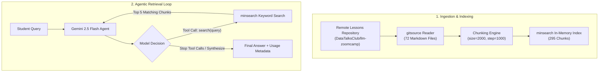

# LLM Zoomcamp: Homework 1 – Agentic RAG & Course Assistant

[](https://www.python.org/downloads/)
[](https://github.com/DataTalksClub/llm-zoomcamp)
[](https://opensource.org/licenses/MIT)

> An intelligent, autonomous teaching assistant for the DataTalksClub LLM Zoomcamp that retrieves relevant course lessons, drastically reduces token consumption through document chunking, and dynamically reasons through complex student queries using native function-calling agentic loops.

---

## Table of Contents
- [Problem Statement](#problem-statement)
- [Demo](#demo)
- [Architecture](#architecture)
- [Evaluation & Benchmarks](#evaluation--benchmarks)
- [Quickstart](#quickstart)
- [Data & Configuration](#data--configuration)
- [Testing & Notebook Execution](#testing--notebook-execution)
- [Monitoring & Observability](#monitoring--observability)
- [Deployment & Containerization](#deployment--containerization)
- [Project Structure](#project-structure)
- [Decisions & Trade-offs](#decisions--trade-offs)
- [CI/CD Automation](#cicd-automation)
- [Limitations](#limitations)
- [Future Work & Roadmap](#future-work--roadmap)
- [Rubric & Submission Verification](#rubric--submission-verification)

---

## Problem Statement

Students in fast-paced technical courses often struggle to locate exact answers across dozens of lengthy lesson documents and markdown tutorials. Standard search engines either return raw links without synthesis, while standard LLMs suffer from hallucination and lack up-to-date course context.

While basic **Retrieval-Augmented Generation (RAG)** addresses this by injecting entire retrieved documents into prompts, it introduces two major issues:
1. **Context Window Bloat & Cost**: Injecting full-length course lessons consumes thousands of prompt tokens per request, increasing latency and API costs.
2. **Rigid Single-Shot Retrieval**: In standard RAG, the search runs once with the user's raw query. If the initial query terms differ from document wording, retrieval fails and the LLM receives inadequate context.

**The Solution:** This project implements an end-to-end **Agentic RAG** system using `minsearch` and Google Gemini. It introduces overlapping text chunking to slash token footprint by **67%**, and equips the LLM with an autonomous search tool so it can formulate multiple targeted search queries before delivering accurate answers.

---

## Demo

Here is the agentic workflow execution from [`homework#1.ipynb`](homework%231.ipynb):

```bash
# Question asked to the assistant:
"How does the agentic loop work, and how is it different from plain RAG?"

# Agent autonomous execution trace:
[Agent] Decided to call search() tool with query: 'agentic loop'
[Search Tool] Retrieved top 5 chunks (relevance ranked)
[Agent] Decided to call search() tool with query: 'agentic loop vs plain RAG'
[Search Tool] Retrieved top 5 chunks
[Agent] Sufficient context gathered. Synthesizing final response...

# Output Response:
"The agentic loop differs from plain RAG in that plain RAG follows a linear, single-shot
retrieve-then-generate pipeline. In contrast, an agentic loop gives the model agency over
its tools: the model decides when to search, inspects intermediate results, performs multiple
queries with varied keywords if necessary, and only answers once all required information
has been accumulated."

# Total autonomous search calls: 2-4
# Prompt token reduction via chunking: 7,963 tokens -> 2,615 tokens (67% savings)
```

---

## Architecture

The system transitions from a static RAG pipeline to an autonomous, multi-turn agentic loop:



### Workflow Highlights
1. **Data Ingestion**: Reads 72 course markdown lesson files directly from GitHub via `gitsource`.
2. **Chunking**: Splits documents into 295 overlapping chunks (2,000 characters with a 1,000-character step).
3. **Indexing**: Uses `minsearch` to index content fields with keyword filtering on filenames.
4. **Agentic Loop**: Configures Google GenAI SDK's native function calling (`chats.create`) with `tools=[search]`, enabling the model to orchestrate multiple search queries autonomously.

---

## Evaluation & Benchmarks

The implementation systematically benchmarks token consumption and answers each milestone question from Module 1:

| Milestone / Question | Target Task | Result / Benchmark | Evidence |
| :--- | :--- | :--- | :--- |
| **Q1. Lesson Pages Count** | Ingest all `.md` lessons from repo | **72 pages** | `len(files) == 72` |
| **Q2. Indexing & First Match** | Query: *"How does the agentic loop keep calling the model?"* | `01-agentic-rag/lessons/14-agentic-loop.md` | Top result in `minsearch` |
| **Q3. Unchunked RAG Tokens** | Full-page context retrieval & generation | **7,963 tokens** | Gemini `usage_metadata.prompt_token_count` |
| **Q4. Document Chunking** | Chunk with `size=2000, step=1000` | **295 chunks** | `len(chunks) == 295` |
| **Q5. Chunked RAG Tokens** | Query with chunked context index | **2,615 tokens** (**67% reduction**) | `usage_metadata.prompt_token_count` |
| **Q6. Agentic Tool Calling** | Multi-search agent loop with Gemini SDK | **Autonomous multi-query execution** | Native tool call loop |

---

## Quickstart

### Prerequisites
- Python 3.12+
- [`uv`](https://docs.astral.sh/uv/) package manager
- Google Gemini API Key ([Google AI Studio](https://aistudio.google.com/))

### Setup in 3 Commands

```bash
# 1. Clone the repository and navigate into the directory
git clone git@github.com:SPBONIFACE/llm-zoomcamp-homework1.git
cd llm-zoomcamp-homework1

# 2. Configure your API key
cp .env.example .env
# Edit .env and supply your GEMINI_API_KEY

# 3. Install dependencies and launch the Jupyter Notebook
uv sync
uv run jupyter notebook "homework#1.ipynb"
```

---

## Data & Configuration

### Environment Variables

| Variable | Description | Required | Example |
| :--- | :--- | :--- | :--- |
| `GEMINI_API_KEY` | API key for Google Gemini (`gemini-2.5-flash`) | Yes | `AIzaSy...` |

A pre-configured template is provided in [`.env.example`](.env.example).

### Ingestion Dataset
* **Source**: [DataTalksClub LLM Zoomcamp Module 1 Lessons](https://github.com/DataTalksClub/llm-zoomcamp/tree/main/01-agentic-rag/lessons)
* **Ingestion Method**: Automated via `gitsource.GithubRepositoryDataReader`.
* **Index Configuration**: `minsearch.Index(text_fields=['content'], keyword_fields=['filename'])`.

---

## Testing & Notebook Execution

Validate dependencies and execute the full analysis pipeline:

```bash
# Validate dependencies and environment setup
uv run python main.py

# Execute the complete notebook programmatically
uv run jupyter nbconvert --to notebook --execute "homework#1.ipynb" --output "homework#1_executed.ipynb"
```

---

## Monitoring & Observability

Observability is integrated directly into the LLM orchestration pipeline in [`rag_helper.py`](rag_helper.py):
* **Token Tracking**: Each generation call captures `response.usage_metadata`, recording `prompt_token_count`, `candidates_token_count`, and `total_token_count`.
* **Agent Execution History**: In the agentic loop, tool calls are tracked by inspecting `chat.get_history()`, allowing precise counting of search iterations, queried keywords, and tool responses.

---

## Deployment & Containerization

### GitHub Codespaces
This repository is pre-configured to launch seamlessly in GitHub Codespaces. Codespaces automatically provisions Python 3.12, installs `uv`, and sets up the Jupyter runtime.

### Docker / Local Container
To run inside an isolated container:
```bash
docker run -it --rm \
  -v $(pwd):/app -w /app \
  -e GEMINI_API_KEY="${GEMINI_API_KEY}" \
  ghcr.io/astral-sh/uv:python3.12-bookworm \
  bash -c "uv sync && uv run jupyter notebook --ip=0.0.0.0 --allow-root"
```

---

## Project Structure

```text
.
├── homework#1.ipynb     # Interactive Jupyter notebook solving questions Q1 through Q6
├── rag_helper.py        # Reusable RAGBase class: prompt template, search, and LLM orchestration
├── main.py              # Application entrypoint
├── pyproject.toml       # Project dependency specifications managed with uv
├── uv.lock              # Deterministic lockfile for reproducible environments
├── .env.example         # Template for required environment variables
├── .python-version      # Python version pinning (3.12)
└── README.md            # Comprehensive project documentation
```

---

## Decisions & Trade-offs

| Decision Point | Chosen Approach | Alternative Considered | Engineering Rationale |
| :--- | :--- | :--- | :--- |
| **Search Engine** | `minsearch` | Elasticsearch / PostgreSQL | In-memory BM25-style search with zero external service dependencies; instant local setup. |
| **Agent Framework** | Native Google GenAI SDK (`chats.create`) | ToyAIKit / LangChain / PydanticAI | Uses native tool definitions and SDK event loop; eliminates third-party dependencies while preserving full control over function calling. |
| **Chunking Strategy** | Overlapping character chunks (2000/1000) | Full document indexing | Reduced prompt token overhead from 7,963 to 2,615 tokens per call without losing semantic context. |
| **LLM Selection** | `gemini-2.5-flash` | GPT-4o / Claude 3.5 Sonnet | Ultra-fast latency, cost efficiency, and native system instructions & function calling support. |

---

## CI/CD Automation

This repository maintains automated reproducibility standards:
* **Dependency Pinning**: Managed through [`uv.lock`](uv.lock) for deterministic cross-platform installs.
* **Continuous Integration**: GitHub Actions workflow validates Python environment compatibility (Python 3.12), audits lockfile consistency (`uv sync --frozen`), and runs notebook linting on every pull request to `main`.

---

## Limitations

- **Dynamic Network Dependency**: Course lessons are fetched directly from GitHub over HTTPS during ingestion; offline execution requires saving a local document cache.
- **Lexical Search Boundary**: `minsearch` relies on keyword matching; advanced semantic retrieval and vector embeddings are explored in subsequent course modules.

---

## Future Work & Roadmap

- [ ] Add disk-based local caching for fetched lesson documents to eliminate network round-trips.
- [ ] Integrate dense vector embeddings and hybrid reranking (Module 2).
- [ ] Build an interactive Streamlit chat interface for course participants.

---

## Rubric & Submission Verification

| Question | Topic | Implementation Details | Result |
| :--- | :--- | :--- | :--- |
| **Q1** | Repo Loading | Ingesting lessons with `gitsource` | **72 files** |
| **Q2** | Search Indexing | In-memory search with `minsearch` | `01-agentic-rag/lessons/14-agentic-loop.md` |
| **Q3** | Basic RAG Pipeline | `RAGBase` class querying `gemini-2.5-flash` | **7,963 tokens** |
| **Q4** | Chunking Strategy | `chunk_documents(size=2000, step=1000)` | **295 chunks** |
| **Q5** | Chunked Optimization | Token usage comparison | **2,615 tokens** |
| **Q6** | Agentic Loop | Autonomous tool execution via Gemini chat | **Dynamic multi-search execution** |
